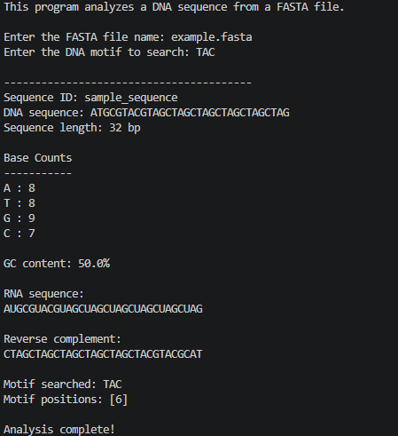

# BioSeq Toolkit

BioSeq Toolkit is my first beginner bioinformatics project. It is a simple Python program that analyzes DNA sequences from a FASTA file.

The goal of this project is not to make an advanced tool. The goal is to practice the basics of Python and bioinformatics in a way that I can understand and explain clearly.

## What This Project Does

The program can:

- read a FASTA file
- check whether the DNA sequence is valid
- check whether the motif is valid
- count A, T, G, and C bases
- calculate GC content
- convert DNA to RNA
- find the reverse complement
- search for a small DNA motif

## Files in This Project

```text
bioinformatics-project-00-seqtool/
├── seqtool.py
├── example.fasta
├── images/
│   └── project_output.png
├── README.md
├── requirements.txt
├── LICENSE
└── .gitignore
```

## How to Run

Open the project folder in the terminal and run:

```bash
python seqtool.py
```

When the program asks for the FASTA file name, enter:

```text
example.fasta
```

When the program asks for the motif, enter:

```text
ATG
```

## Example Input

```text
>sample_sequence
ATGCGTACGTAGCTAGCTAGCTAGCTAGCTAG
```

## Tested Output

```text
Welcome to BioSeq Toolkit!
This program analyzes a DNA sequence from a FASTA file.

Enter the FASTA file name: example.fasta
Enter the DNA motif to search: ATG

----------------------------------------
Sequence ID: sample_sequence
DNA sequence: ATGCGTACGTAGCTAGCTAGCTAGCTAGCTAG
Sequence length: 32 bp

Base Counts
-----------
A : 8
T : 8
G : 9
C : 7

GC content: 50.0%

RNA sequence:
AUGCGUACGUAGCUAGCUAGCUAGCUAGCUAG

Reverse complement:
CTAGCTAGCTAGCTAGCTAGCTACGTACGCAT

Motif searched: ATG
Motif positions: [1]

Analysis complete!
```

## Program Output Screenshot

The screenshot below shows the program running successfully using the sample FASTA file included in this repository.



## What I Learned

While making this project, I practiced:

- writing basic Python functions
- using strings in Python
- reading a text file
- working with DNA sequence data
- validating simple user input
- calculating simple biological statistics
- organizing a small GitHub project

## Why This Project Matters

Most bioinformatics work starts with biological sequence data. This project helped me understand the basic operations that are used before moving into larger datasets and more advanced tools.

## Next Step

The next project will build on this by analyzing multiple FASTA sequences and creating a simple summary table.
